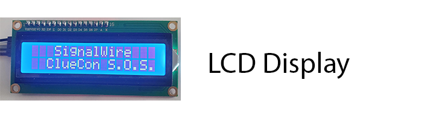
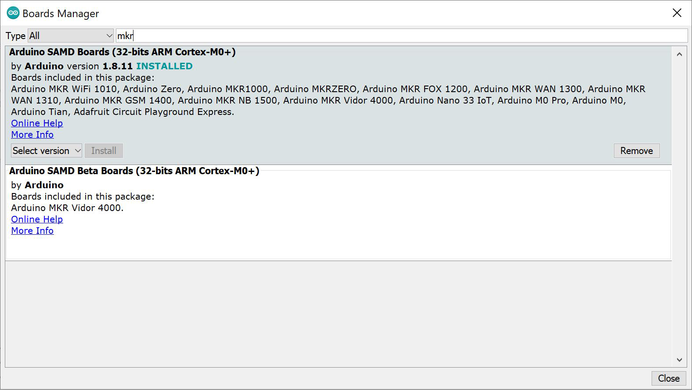

# Cluecon 2021 Arduino Challenge 3
Using an Arduino board, and sensors create a solution that will allow 
you to detect the voltage of a power source. You can use your imagination and any 
code snippets provided to aid in your quest.  There are many different 
ways to solve the objective, Be creative and have fun with it!
## About Cluecon 2021 Arduino Challenge 3
For this challenge you will demonstrate your technical skills to measurse the voltage of a battery. You can experiment with different home made batteries and see which one will be most effective.   
  
  
## Getting Started
- [x] Arduino IDE 
- [x] Putty or Similar for opening serial port 
- [x] Arduino MKR WiFi 1010 or Similar 
- [x] Micro USB Cable 
- [x] Jumper/Hookup Wires
- [x] Voltage Meter Sensor
- [x] Liquid Crystal Display
## Cluecon 2021 Arduino Challenge 3 - How It Works
The voltage sensor will provide a readout on how many volts the home made batteries generate.  You can be creative and use different materials, and experiment with series and parallel circuits to produce a higher output.  
## Let's Get Started
Prepare Your Coding Enviroment 
1. Install Arduio IDE - [Installing Arduino IDE](https://www.arduino.cc/en/guide/windows) 
2. Then open and goto Tools -> Boards -> Boards Manager 
3. Type in 'MKR' and make sure that 'Arduino SAMD Boards (32-bits ARM Cortex-M0+)' is Installed, If not 
click install  
4. Take inventory and prepare your sensors for what you need 
5. Code! - There are examples included, to get you started, and we are here to help.
# More Documentation
You can find more documentation on LaML, Relay, and all Signalwire APIs 
at: 
- [SignalWire API Docs](https://docs.signalwire.com) 
- [SignalWire Github](https://gituhb.com/signalwire) 
- [Arduino IDE](https://www.arduino.cc/en/guide/windows) 
- [PuTTY Client](https://www.chiark.greenend.org.uk/~sgtatham/putty/latest.html)
# Support
If you have any issues or want to engage further about this Signal, 
please [open an issue on this repo](../../issues) or join our fantastic 
[Slack community](https://signalwire.community) and chat with others in 
the SignalWire community! If you need assistance or support with your 
SignalWire services please file a support ticket from your Dashboard.
